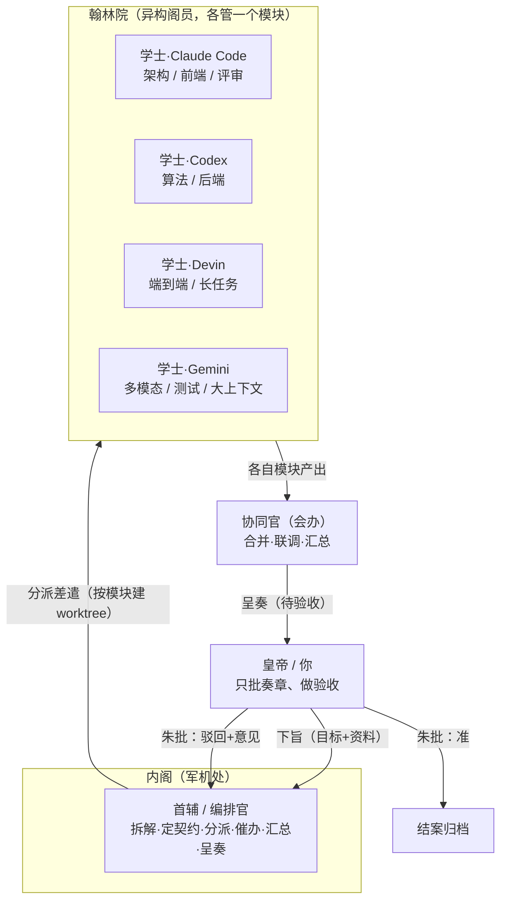
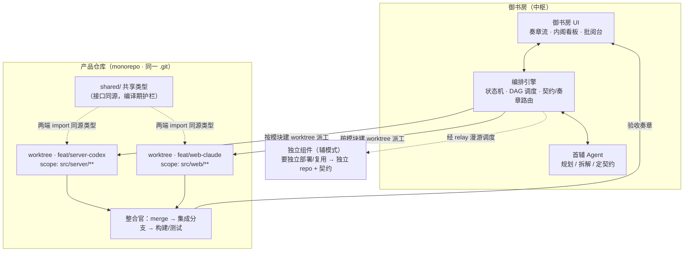
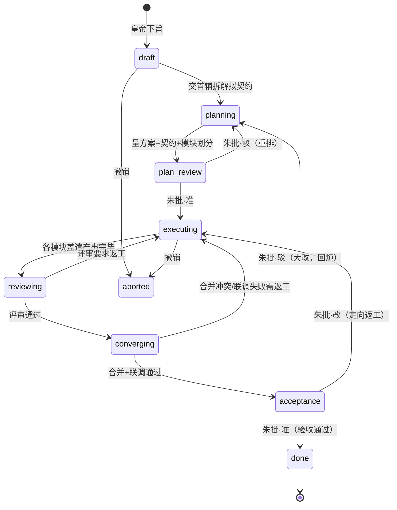
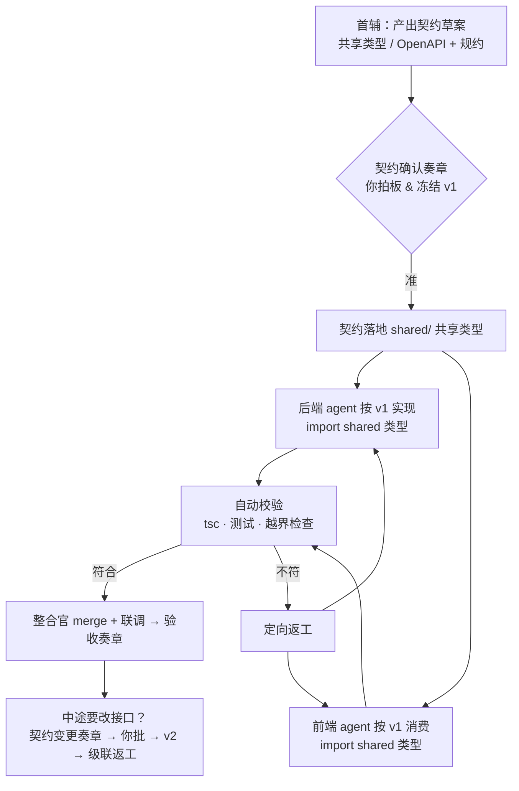
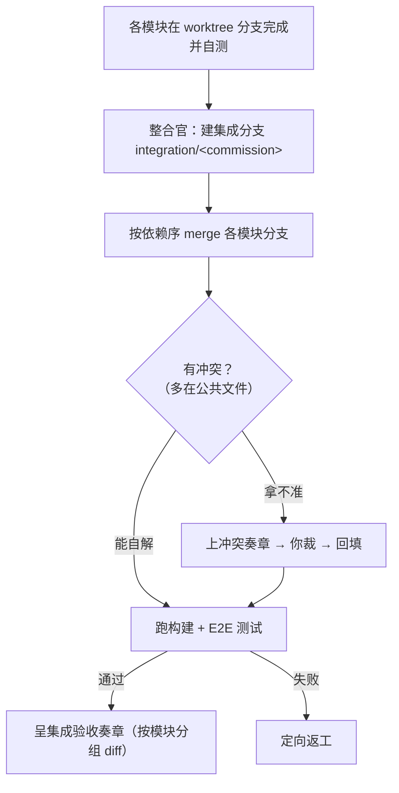
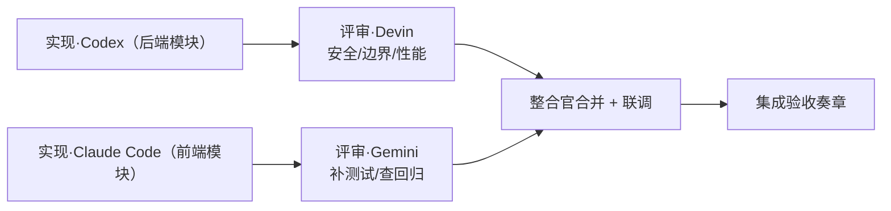
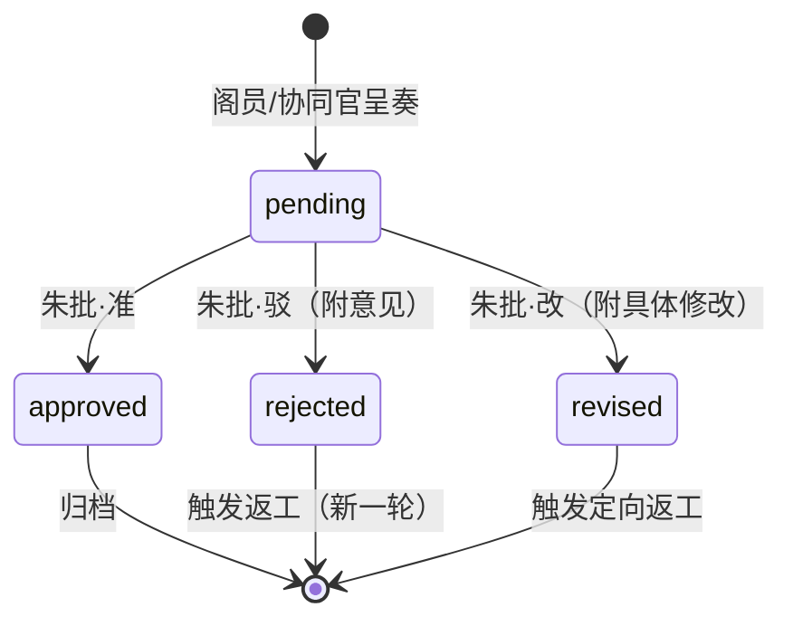
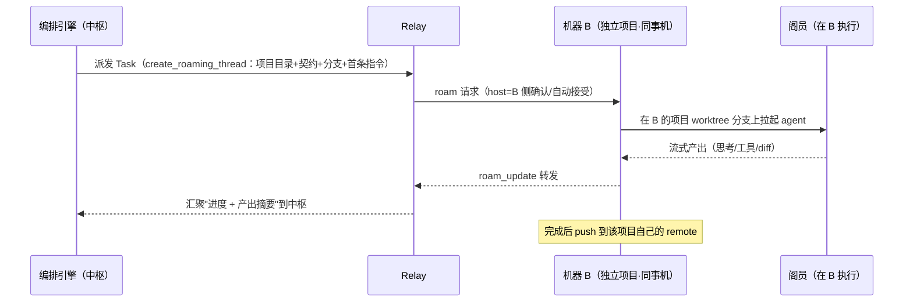
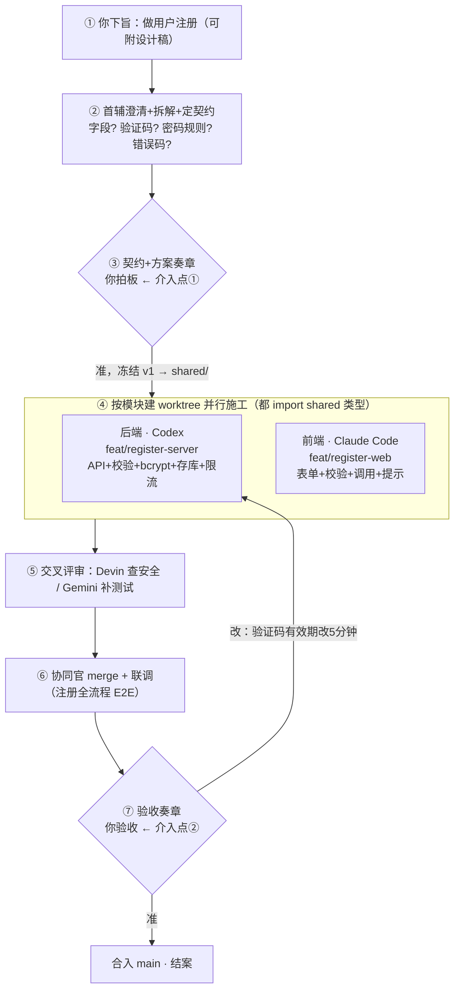

# 御书房 · AI 内阁协作系统设计

> **一句话愿景**：把 Codex、Devin、Claude Code、Gemini 这些各有所长的 AI 编成一支"内阁"，让它们在**同一个产品仓库**里按模块分工、按契约协同、交叉评审；你只做一件事——**坐在御书房里批阅奏章**，准或驳，直到满意为止。

| 项目 | 内容 |
| --- | --- |
| 文档定位 | 新功能设想 / 架构提案（供讨论，非最终实现方案） |
| 依托产品 | Nova（Tauri 2 + SolidJS 桌面端，驱动 ACP 兼容 agent） |
| 已有基座 | 多会话并行、跨机漫游、团队分享、worktree、上下文接力、relay 中转 |
| 新增主题 | 异构 AI 团队编排 · 模块化协同 · 多轮迭代验收 |
| 目标读者 | 团队成员 / 协作方（不熟悉本项目代码亦可读懂） |

---

## 已达成的关键共识

> 以下方向已拍板，本文据此设计。

| # | 议题 | 结论 |
| --- | --- | --- |
| 1 | **编排大脑** | **分离式**：规划 agent 出方案，编排引擎（代码）做调度——确定性强、可调试。 |
| 2 | **代码怎么组织** | **默认一个仓库（monorepo）**：一个产品/功能的前后端本就强内聚，放一起最好；只有"独立生命周期的组件"（独立部署的服务、被复用的库、跨机既成事实）才拆独立仓。 |
| 3 | **协同粒度** | **主模式 = 模块**：同一 monorepo 内按路径边界用 worktree 分给不同 agent，靠**共享类型**对齐、最后**合并**。**辅模式 = 独立项目**：跨仓靠契约、不合并。 |
| 4 | **自动化 vs 可控** | **关卡制**：方案/契约/验收必过审；冲突/歧义先由 agent 自解，拿不准才上奏。 |

核心原则一句话：**代码怎么组织，跟着"业务内聚度"走，不跟着"角色分工"走。多角色 ≠ 多项目。**

---

## 目录

1. [缘起：从"漫游/并行"到"AI 内阁"](#一缘起从漫游并行到-ai-内阁)
2. [设计目标与非目标](#二设计目标与非目标)
3. [核心隐喻：御书房](#三核心隐喻御书房)
4. [为什么要"异构"团队](#四为什么要异构团队)
5. [代码怎么组织：默认一个仓库](#五代码怎么组织默认一个仓库)
6. [可复用的现有能力盘点](#六可复用的现有能力盘点)
7. [总体架构](#七总体架构)
8. [核心概念与数据模型](#八核心概念与数据模型)
9. [编排引擎：军机处怎么运转](#九编排引擎军机处怎么运转)
10. [协同与整合：多 agent 如何不打架（核心）](#十协同与整合多-agent-如何不打架核心)
11. [多轮迭代：直到验收](#十一多轮迭代直到验收)
12. [跨机器 / 跨项目：补充模式](#十二跨机器--跨项目补充模式)
13. [御书房 UI 设计](#十三御书房-ui-设计)
14. [实战演练：用户注册从需求到验收](#十四实战演练用户注册从需求到验收)
15. [异构 Agent 如何接入](#十五异构-agent-如何接入)
16. [实现落点（映射现有代码）](#十六实现落点映射现有代码)
17. [分阶段路线图](#十七分阶段路线图)
18. [关键取舍与后续待定](#十八关键取舍与后续待定)
19. [风险与开放问题](#十九风险与开放问题)
20. [附录：relay 新增消息类型速查](#附录relay-新增消息类型速查)

---

## 一、缘起：从"漫游/并行"到"AI 内阁"

Nova 目前已经具备三块关键能力：

- **多会话并行**：多个 Thread 各自绑定目录与 agent，独立运行、互不干扰。
- **远程漫游**：会话可以"投屏"到别人机器执行——`host` 在本机跑 agent，`guest` 只发指令看结果，一切经 relay 中转。
- **团队分享**：把会话（甚至"用模型处理后的成果"）分享给队友。

这三块能力有一个共同的隐含前提：**背后始终是"一个人 + 一个 agent"在推进一件事**。

而这次要做的，是把主语换掉：

> 从「**我**指挥**一个** agent 干活」，升级成「**一支由不同 AI 组成的团队**自己干活，我只负责给料和验收」。

一个需求（比如"做用户注册"）天生需要多个角色：产品澄清、接口设计、后端、前端、测试、评审。这些角色由不同的异构 AI 担纲、在**同一个产品仓库**里按模块分工协作，只在关键节点向你呈奏。

---

## 二、设计目标与非目标

### 目标

- **G1｜异构组队**：把不同 agent（Codex / Devin / Claude Code / Gemini / 任意 ACP agent）编入同一支团队，各承担不同职能。
- **G2｜自主协作**：团队拿到"资料 + 目标"后能自行拆解、分派、执行、互评，无需人盯每一步。
- **G3｜模块化协同**：默认在**一个仓库**内按模块分工，靠**共享类型/契约**对齐，最终**合并**成一个可验收的整体。
- **G4｜多轮迭代**：人对产出的批注（朱批）能回注团队，触发定向返工，循环直到验收。
- **G5｜御书房体验**：人面对的是"奏章流"而非"聊天流"，只在关键决策点介入。
- **G6｜最大化复用**：在现有 ACP / 漫游 / worktree / handoff / relay 之上扩展，不另起炉灶。

### 非目标（本期不做）

- 不追求"全自动无人值守"——**人是最终裁决者**，关键关卡必须过审。
- 不做通用工作流编排平台，只做"面向 AI 协作"的轻量编排。
- 不实现 agent 之间实时"对话辩论"（成本与可控性差），协作以**共享类型/契约与产物交接**为主。
- 不强制拆分仓库——拆分只留给真正需要"独立生命周期"的组件。

---

## 三、核心隐喻：御书房

用一套古代朝堂的隐喻，把复杂的多 agent 编排讲成人人能懂的故事：



### 角色映射表

| 隐喻 | 系统角色 | 说明 | 现实载体 |
| --- | --- | --- | --- |
| **皇帝** | 人类用户 | 唯一的最终决策者，只看奏章、下朱批 | 你 |
| **下旨** | 立项 | 给出目标 + 参考资料（需求、设计稿、约束） | 一次 Commission 创建 |
| **首辅 / 军机大臣** | 编排官（Orchestrator） | 拆任务、定契约、分派、催办、汇总、呈奏 | 编排引擎 + 一个"规划 agent" |
| **翰林学士** | 阁员（Employee） | 具体干活的 AI，各有专长，各管一个模块 | 一个 agent 后端 + 角色档案 |
| **差遣 / 敕令** | 工序任务（Task） | 分派给某位阁员、在某个模块里执行的子任务 | 一个 Thread + 一个 worktree |
| **定制 / 契约** | Contract | 模块之间的接口约定（共享类型 / API / 事件） | 结构化契约 + 共享类型文件 |
| **协同官 / 会办** | Coordinator | 合并各模块分支、联调、汇总呈奏 | 一个被指定的强 agent |
| **奏章 / 奏折** | Memorial | 需要皇帝定夺或验收的呈报 | 结构化审阅卡片 |
| **朱批** | Rescript | 皇帝的批复：准 / 驳 / 改 + 批注 | 一次审阅动作 |
| **御书房** | 审阅台 | 皇帝批奏章的地方 | 新增前端视图 |
| **邸报 / 起居注** | 执行记录 | 每位阁员干活的完整过程 | 现有 transcript |

> 隐喻只是"皮"，底下每个角色都对应现有系统里一个真实的、已存在或可扩展的机制（见落点表）。

---

## 四、为什么要"异构"团队

如果只是"多开几个同款 agent"，收益有限。真正的价值在于**能力互补 + 交叉校验**。

### 能力矩阵（示意，可按实际调整）

| 阁员 | 相对强项 | 典型职能 | 备注 |
| --- | --- | --- | --- |
| **Claude Code** | 复杂推理、架构设计、代码质量与可读性、评审 | 架构师 / 首辅 / 前端 / 协同官 | 适合当"首辅"或"协同官" |
| **Codex（GPT）** | 算法、快速编码、按规格实现 | 后端 / 实现工程师 | 吞吐快 |
| **Devin** | 自主性强、端到端长任务、能自己跑通链路 | 独立承包某个完整模块 | 已是本项目原生后端 |
| **Gemini** | 超大上下文、多模态（读设计图）、成本友好 | 资料消化 / 写测试 / 文档 | 长文档、截图理解 |

### 异构带来的三种协作花样

1. **分工并行**：把一个功能按模块切块，多个 AI 同时开工，缩短总时长。
2. **交叉评审**：A 写、B 审——不同模型的"思维盲区"不同，互评能显著提质（同构团队给不了）。
3. **择优/对赌**：同一子任务让两位阁员各做一版，择优采纳（借鉴 best-of-N 思路）。

> **一句话**：异构团队的核心红利不是"更多手"，而是"**不同的脑**"——分工提速、互评提质。

---

## 五、代码怎么组织：默认一个仓库

这是本设计的一个关键立场，先讲清楚，因为它决定了后面所有协同机制。

### 5.1 一条核心原则

> **代码怎么组织，跟着"业务内聚度"走，不跟着"角色分工"走。**

一个功能的前端和后端，是同一件事的两面：它们几乎总是**一起改、一起发布、一起回滚**。这种强内聚的东西天生该待在一起。"谁写前端、谁写后端"是**分工**问题——分工用仓库内部的**模块边界 + worktree** 表达即可，不必靠拆仓库。**把"多角色"当成"拆多仓库"的理由，是最常见的误区。**

### 5.2 为什么默认 monorepo（对本场景）

1. **接口漂移几乎被消灭**：前后端 `import` 同一份类型（`shared/types/*.ts`），类型同源，调错字段**编译期**就报错——比跨仓库靠 OpenAPI + 契约测试对齐更硬、更省。
2. **原子提交/回滚**：一个需求 = 一次完整变更，改接口时前后端在同一提交里一起改，不会版本错配。
3. **联调 / E2E 最简单**：都在一处，协同官拉起来就能跑通全流程。
4. **对 AI 尤其友好**：AI 最怕上下文割裂——同仓库里评审/协同官能同时看到两端，判断更准；共享类型是给 AI 的强护栏（漂移对 AI 比对人更致命）。

唯一要处理的是**多 agent 并发写冲突**——用 **worktree 分模块 + 边界约束**解决（见 §10）。于是：**monorepo（组织） + worktree 按模块隔离（并发执行）= 两全其美。**

### 5.3 什么时候才拆成多个仓库

拆仓解决的是**"组织和部署"**问题，不是"分工"问题。判断标准一句话：**"会不会经常一起改、一起发布？"——会就合，各有各的生命周期就拆。**

| 放进一个 monorepo（默认） | 拆成独立 repo（例外） |
| --- | --- |
| 同一产品的前后端 | 需要**独立部署**的微服务 |
| 强内聚、同步变更 | 有**独立发布节奏** |
| 共享类型 / 工具链 | 被多方复用的 **SDK / 库** |
| 需要频繁联调 | 清晰的**独立团队所有权** |
| 起步 / 中小规模 | 规模大到 CI / 权限成瓶颈 |

> 与业界共识一致：**默认从单体 / monorepo 起步，出现明确的、由规模或部署驱动的理由时，再把某部分"毕业"拆出去**。过早拆分（过早微服务化）是经典反模式。

### 5.4 两种协作模式：有主有次

| | **主模式：模块（monorepo + worktree）** | **辅模式：独立项目（多仓 + 契约）** |
| --- | --- | --- |
| 代码组织 | 一个仓库，切成多个模块 | 多个独立仓库 |
| 机器 | 通常同机（worktree 共享 `.git`） | 可跨机 |
| 隔离 | worktree 分支 + 路径 scope | 不同 repo |
| 对齐 | **共享类型**（编译期护栏）+ 契约 | 契约（OpenAPI）+ 契约测试 |
| 收尾 | **合并**各分支到集成分支 | 不合并，各自 push |
| 何时用 | 默认 | 独立生命周期组件 / 跨机既成事实 |

---

## 六、可复用的现有能力盘点

好消息：这套设想**几乎不需要从零造轮子**。现有代码里已经藏着所有关键零件。

| 现有能力 | 现状 | 在内阁里的新用途 | 代码位置 |
| --- | --- | --- | --- |
| **ACP 多后端** | Devin / Codex / CodeBuddy 三个独立 manager，且"任意 ACP agent 可接入" | 每位阁员 = 一个 agent 后端；扩展成 N 个 | `acp.rs` / `codex.rs` / `lib.rs` |
| **多会话并行** | Thread 各自独立运行 | 每个"差遣"= 一个 Thread，天然并行 | `threads.rs` |
| **worktree** | 会话在独立分支+目录执行，不扰主工作区 | **主模式基石**：每个模块一条 worktree 分支 | `gitwt.rs` / `lib.rs` |
| **漫游（host/guest）** | 会话可在他人机器执行、结果回传 | 辅模式：调度别的机器上的独立项目 | `relay.rs` / `roam.rs` / `store.ts` |
| **上下文接力（handoff）** | 跨 agent 切换时把历史渲染成上下文注入新 agent | 下发契约、把朱批回注下一轮 | `threads.rs::render_handoff_context` |
| **高级分享（advanced_share）** | 用模型按提示词处理会话、跑完自动分享结果 | "阁员自动产出成果 → 呈报"的雏形 | `relay.rs::advanced_share` |
| **relay 中转** | HTTP 发 / SSE 收，token 身份，群组隔离，断点续传 | 内阁全部信令与产物回报的通道 | `server/main.go` / `relay.rs` |
| **权限审批** | 敏感操作弹卡片，人放行/拒绝；Bypass 可全自动 | 归入"奏章"体系，成为一种奏章类型 | `acp.rs` / `PermissionCard.tsx` |
| **附件内嵌** | 图片/文件 base64 内嵌跨机传输（≤25MB） | 跨机传递契约文件 / 设计稿 / 类型定义 | `threads.rs::embed_attachment_data` |
| **快照重同步** | 漫游断线/轮次结束按 id reconcile 自愈 | 内阁看板的状态最终一致 | `store.ts` `acp:reload` |

> 结论：**内阁 = 现有"worktree + 并行 + 漫游 + handoff + share"的一次编排层封装**。新增的主要是"编排引擎 + 契约/奏章体系 + 御书房 UI"，底层执行链路基本现成。

---

## 七、总体架构

默认一个产品仓库（monorepo），内部按模块用 worktree 分给不同 agent；中枢负责调度、存状态、路由契约与奏章。



**三个平面：**

- **控制平面**：编排引擎驱动状态机、按 DAG 调度、路由契约与奏章。
- **执行平面**：各 agent 在自己的 worktree 分支上干活（现有 worktree 链路），互不干扰。
- **对齐平面**：模块间靠 `shared/` 共享类型（编译期护栏）+ 契约；整合官负责合并、联调、呈奏。

**编排中枢放哪？** 放在你的机器上，只做调度/存状态/路由。主模式下 worktree 都在产品仓库所在机器；辅模式（独立组件/跨机）经 relay 漫游调度。

---

## 八、核心概念与数据模型

下面用 TypeScript 风格给出数据结构（与前端 `types.ts` 一致，Rust 侧对应 `serde` 结构）。

```typescript
/** 阁员：一个"数字员工"= 一个 agent 后端 + 角色档案 */
interface Employee {
  id: string;
  name: string;                 // "学士·Claude"
  agentKind: string;            // devin | codex | claude-code | gemini | ...（不再硬编码枚举）
  model?: string;
  mode?: string;                // code / ask / plan / bypass
  role: string;                 // architect / backend / frontend / reviewer / tester / coordinator
  systemPrompt?: string;        // 角色设定（可引用 skill 文件）
  strengths: string[];          // 专长标签，供首辅分派时参考
}

/** 分工单元：一次差事的最小分派单位，可以是「模块」（主）或「独立项目」（辅） */
type WorkUnit = ModuleUnit | ProjectUnit;

/** 模块（主模式）：同一 monorepo 内、按路径边界划分给某位阁员 */
interface ModuleUnit {
  kind: "module";
  id: string;
  name: string;                 // "后端 / server"、"前端 / web"
  scope: string[];              // 可写路径 glob，如 ["src/server/**"]；越界会被守护拦下
  assigneeId: string;           // 阁员 id
  worktreeBranch: string;       // feat/register-server-codex
}

/** 独立项目（辅模式）：独立 repo，可能在别的机器，靠契约协同、不合并 */
interface ProjectUnit {
  kind: "project";
  id: string;
  name: string;
  machine?: string;             // relay token；null = 本机
  cwd: string;
  repo?: string;                // 独立 remote
  assigneeId: string;
}

/** 契约：模块/项目之间的接口约定（共享类型 / API 规格 / 事件） */
interface Contract {
  id: string;
  commissionId: string;
  title: string;                // "注册 API v1"
  producerUnitId: string;       // 提供方（如后端模块）
  consumerUnitIds: string[];    // 消费方（如前端模块）
  spec: string;                 // 契约正文（TS 类型 / OpenAPI / markdown）
  sharedTypePath?: string;      // monorepo 主模式：落地到 shared/ 的类型文件
  version: number;
  hash: string;                 // 内容哈希，供跨机校验"是不是同一份"
  state: "draft" | "confirmed" | "changed";
}

/** 内阁：一支团队 = 一组阁员 + 首辅/协同官指派 */
interface Team {
  id: string;
  name: string;
  members: Employee[];
  chiefId: string;              // 首辅（规划者）
  coordinatorId: string;        // 协同官（会办 / 整合官）
}

/** 差事：一项完整工程（对应"一次立项"） */
interface Commission {
  id: string;
  title: string;
  goal: string;                 // 皇帝下的旨意
  materials: Attachment[];      // 提供的资料（需求/设计稿/约束）
  team: Team;
  repo?: string;                // 主仓库（monorepo 主模式）
  units: WorkUnit[];            // 分工单元：模块为主、独立项目为辅
  contracts: Contract[];        // 接口契约（含共享类型）
  charter?: string;             // 团队规约（命名/错误码/时间格式/鉴权/目录/技术栈…）
  workflow: Task[];             // 工序（DAG）
  integrationBranch?: string;   // 主模式的集成分支
  state: CommissionState;
  round: number;                // 第几轮迭代
  createdAt: number;
  updatedAt: number;
}

type CommissionState =
  | "draft" | "planning" | "plan_review"
  | "executing" | "reviewing" | "converging"
  | "acceptance" | "done" | "aborted";

/** 工序/差遣：分派给某位阁员、在某个单元里执行的子任务 */
interface Task {
  id: string;
  commissionId: string;
  unitId: string;               // 在哪个模块/项目上执行
  title: string;
  brief: string;                // 交办说明（含验收标准、相关契约 id、scope）
  assigneeId: string;
  deps: string[];               // 依赖的其他 task（DAG 边）
  kind: "build" | "review" | "test" | "contract" | "converge" | "research";
  threadId?: string;            // 实际执行的会话
  worktreeBranch?: string;
  output?: TaskOutput;
  status: "pending" | "running" | "submitted" | "accepted" | "rework";
}

interface TaskOutput {
  summary: string;
  branch?: string;
  diffStat?: string;            // +x -y 文件数
  report?: string;              // 信息型产物（方案/评审/联调结论）
  artifacts?: Attachment[];
}

/** 奏章：需要皇帝定夺/验收的呈报 */
interface Memorial {
  id: string;
  commissionId: string;
  taskId?: string;
  type: MemorialType;
  from: string;
  title: string;
  body: string;                 // 正文（markdown）
  options?: MemorialOption[];   // 供皇帝择决（方案 A/B/C）
  diff?: DiffBundle;            // 待验收的代码改动（按模块分组）
  state: "pending" | "approved" | "rejected" | "revised";
  rescript?: Rescript;
  ts: number;
}

type MemorialType =
  | "plan" | "contract" | "choice"
  | "acceptance" | "conflict" | "help" | "permission";

/** 朱批：皇帝的批复 */
interface Rescript {
  decision: "approve" | "reject" | "revise";
  comment?: string;             // 批注意见（驳回/修改时回注给团队）
  choiceId?: string;
  ts: number;
}
```

**关键设计取向：**

- `Task.threadId` 复用现有 Thread；`Task.worktreeBranch` 复用现有 worktree——**每个差遣 = 一个会话 + 一条分支**，执行、transcript、权限、隔离全现成。
- `WorkUnit` 统一抽象"模块（主）"与"独立项目（辅）"，编排引擎对两者统一调度。
- `Contract.sharedTypePath`：主模式下契约直接落成 `shared/` 里的**共享类型文件**，两端 import，编译期兜底。
- `Employee.agentKind` 从硬编码枚举改为**字符串 + 可配置后端表**，才能容纳 Claude Code / Gemini（见 §15）。

---

## 九、编排引擎：军机处怎么运转

### 9.1 工作流状态机



### 9.2 编排拓扑

已定为**主从 + DAG 混合**：首辅（规划 agent）动态产出一张 DAG（含"契约→实现→评审→整合"的边），编排引擎按依赖调度、按并发上限执行。

### 9.3 首辅的职责 —— 分离式

> 已定：**规划 agent 出方案 + 编排引擎（代码）做调度**，分离。

- **规划 agent 负责"想"**：读目标+资料，输出：① 模块划分（每个模块的 scope + 建议阁员）；② 模块间**契约草案 / 共享类型**；③ 任务 DAG。打包成"方案+契约"奏章。
- **编排引擎负责"调"**（纯代码，确定性强）：拓扑排序 + 并发闸门；依赖满足即建 worktree 派工；监听 `acp:turn` 判定完成、收集产出；触发奏章、路由朱批、驱动状态流转；超时/失败/重试。

> **为什么分离**：确定性的调度归代码（可靠、可测），开放性的判断归 agent（灵活）。避免整个编排交给一个 agent"黑箱"——那样不可控、难调试。

---

## 十、协同与整合：多 agent 如何不打架（核心）

多个异构 agent 在同一个仓库里并行改代码，最怕"接口对不上、互相踩、合不拢"。解法沿用软件工程成熟的**契约驱动开发（Contract-First）**，分四层设防。

### 10.1 四层设防

> 把"接口和规范"变成一份 **机器可读、人先拍板、全员强制遵守、能自动校验** 的"单一事实来源"。

| 层 | 目标 | 主模式（monorepo）手段 | 辅模式（多仓）手段 |
| --- | --- | --- | --- |
| **① 预防** | 开工前对齐 | 共享类型 + 契约先行 + 规约 | 契约先行（OpenAPI）+ 规约 |
| **② 消除** | 让"对不上"物理上不可能 | **共享类型，编译期护栏** | 从契约生成同源类型 |
| **③ 检测** | 跑偏被自动发现 | tsc + 测试 + **越界检查** | spec lint + 契约测试(Pact) |
| **④ 兜底** | 漏网也拦得住 | 整合官合并校验 + 你验收 | 协同官校验 + 你验收 |

**契约驱动的完整生命周期：**



### 10.2 主模式：monorepo 内怎么保证不打架

**(1) 共享类型 = 最强的"消除"手段**
接口定义落在 `shared/types/*.ts`，前后端都 import。前端调错字段、后端漏返回字段，`tsc` 编译期直接报错——对不上物理上不可能，比事后校验硬得多。

**(2) worktree 分模块 = 物理隔离**
每个模块一条 worktree 分支（`feat/<module>-<agent>`，base=main），目录物理隔离，agent 各干各的，运行期互不干扰。

**(3) 边界（scope）+ 越界守护**
每个模块 Task 标注 `scope`（可写路径 glob，如 `src/server/**`）。提交时用 `git diff --name-only` 检查改动是否越界，越界则挡回或上"越界奏章"。**这是现有 worktree 之上要新增的约束。**

**(4) 公共文件才是冲突高发区**
模块内文件基本不冲突，真正打架的是大家都要改的公共文件（路由注册表、DI 容器、`package.json`、i18n、DB migration 汇总）。三种解法：
- **自注册扩展点（最优）**：让模块自注册——每个模块导出自己的路由/配置，主文件用约定 glob 自动收集，从源头消灭并发修改。
- **收归统一**：公共文件改动交给首辅/协同官一人做，模块 agent 只"申报需求"。
- **模块级契约**：模块间调用走 `shared/` 约定接口，即使同仓库也用契约机制。

**(5) 合并流程（整合官）**



- `gitwt.rs` 现有 add/remove，**需新增 merge / 冲突检测 / 越界检查**能力。
- 集成分支独立，失败不污染任何模块分支，可随时丢弃重来。

### 10.3 协同官（会办）

一个被指定的强 agent，负责：① 合并各模块分支到集成分支、解冲突；② 联调（跑通端到端）；③ 汇总成一份**验收奏章**（按模块分组展示 diff + 测试结果）呈交御书房。

### 10.4 交叉评审：异构团队的杀手锏

在 DAG 里加一条"评审边"即可：



- 评审阁员的输入 = 被评审模块的 diff + 报告；用**与实现者不同的模型**换个"脑"查盲区（尤其安全）。
- 评审产物可以是"评审奏章"（供你参考），也可直接退回要求原作者返工（`status: rework`）。

### 10.5 回滚

- 每个模块分支独立，回滚只影响该模块（复用 `remove_worktree` / 文件级 `revert_file_changes`）。
- 每轮产物留痕，御书房可对比历轮 diff。

> **一句实话**：没有 100% 的保证（agent 仍可能跑偏），但"预防→消除→检测→兜底 + 你验收"的多层防御把冲突压到很低，且**任何漏网的冲突都能在你验收之前被自动或协同官发现**——已与一支纪律良好的人类团队处在同一水平。

---

## 十一、多轮迭代：直到验收

"一次到位"是奢望。系统必须把"**看了不满意 → 带着意见返工 → 再看**"做成一等公民。

### 11.1 奏章生命周期



### 11.2 朱批的三种力度

| 朱批 | 含义 | 触发的动作 | 迭代范围 |
| --- | --- | --- | --- |
| **准（approve）** | 认可 | 该奏章关闭；若是最终验收 → Commission `done` | — |
| **驳（reject）** | 大方向有问题 | 回 `planning`，首辅结合意见重排/改契约 | 可能整体回炉 |
| **改（revise）** | 方向对、细节要改 | 回 `executing`，**只重派相关模块的 Task** | 定向、最省 |

### 11.3 意见如何"回注"团队

多轮迭代的技术关键——**朱批不能只是关掉卡片，得变成下一轮的输入上下文**：

- 复用 `render_handoff_context`：把「上一轮该模块做了什么 + 皇帝的朱批意见 + 相关契约/产物」渲染成上下文，注入下一轮同一位阁员的会话开头。
- `Commission.round` 递增；每轮产物留档，御书房可对比历轮 diff。
- **若朱批改的是契约** → 相关消费方模块被一并标记返工（契约变更级联）。

### 11.4 "直到验收"的收敛保证

- 只有皇帝对**最终验收奏章**朱批"准"，Commission 才 `done`。
- 防无限循环：设"最多 N 轮"软上限，达到后强制上"是否继续/收尾"奏章，由皇帝定夺。

---

## 十二、跨机器 / 跨项目：补充模式

主模式（monorepo + worktree）都在产品仓库所在的**一台机器**上。以下两种情况走**辅模式**：

1. **独立生命周期组件**：某部分要独立部署/复用 → 拆成独立 repo，靠契约协同、不合并。
2. **跨机既成事实**：某个仓库就在别的机器上（比如前端在同事机）→ 经漫游调度。

### 12.1 跨机执行（复用漫游）



### 12.2 辅模式下如何对齐与整合

- **对齐**：跨仓没有共享类型，靠 OpenAPI 契约 + **契约测试（Pact）**——前端声明期望、后端验证满足，专为跨服务/异地设计。
- **一致性**：契约带**版本号 + 哈希**，agent 开工前校验手里契约与中枢一致；经 relay `contract_publish` 下发。
- **整合**：不合并代码，协同官核对两侧是否都符合契约 + 联调，汇总呈奏。
- **传输**：跨机流动的只有"信息"（进度、摘要、契约、附件 ≤25MB），**代码留在各自项目**。

---

## 十三、御书房 UI 设计

体验原则：**默认安静，只在该我出手时叫我**。它不是聊天窗，而是"待办 + 决策"面板。

### 13.1 三个视图

**(1) 奏章流（御案 / Inbox）**——默认落地页

```
┌────────────────────────────────────────────┐
│  御书房           待批 3 · 进行中 2 · 已结案 8 │
├────────────────────────────────────────────┤
│ ● [契约] 注册 API v1 · 待你拍板接口            │
│     首辅呈 · 后端↔前端 · 附字段清单            │
├────────────────────────────────────────────┤
│ ● [验收] 用户注册 · 合并+联调通过待验收        │
│     协同官呈 · 第 2 轮 · 后端 +420 / 前端 +392 │
│     [看后端diff] [看前端diff] [准] [改…] [驳…] │
├────────────────────────────────────────────┤
│ ○ [求助] 学士·Gemini：缺设计稿切图，请补充     │
└────────────────────────────────────────────┘
```

**(2) 内阁看板（工序 / Kanban + DAG）**——想看细节时才进

- 一张 DAG 图 + **按模块分泳道**，显示每位阁员、每个 Task 的状态（待派/执行中/已交/评审中/整合中/返工）。
- 点某个 Task 可下钻到它的 Thread transcript（完整过程，复用现有聊天视图）。

**(3) 批阅台（单奏章详情）**

- 契约奏章：字段/接口清单，可逐条批注、准或改。
- 验收奏章：**按模块分组**的 diff + 协同官说明 + 联调结论；底部按钮：**准 / 改（填意见）/ 驳（填意见）**。
- 冲突/分歧奏章：两种取舍并列，供裁定。

### 13.2 交互要点

- **朱批即回注**：填在"改/驳"里的意见，直接成为下一轮上下文，无需再开聊天解释。
- **一键旁观**：任何 Task 都能"进去看"，但不强制。
- **通知**：有新奏章待批时走现有系统通知（窗口不在前台也能提醒）。

---

## 十四、实战演练：用户注册从需求到验收

用一个完整例子把前面所有概念串起来，采用推荐的 **monorepo + worktree 分模块**。

### 14.1 全流程



**你全程只在两处出手**：③ 确认契约、⑦ 最终验收。

### 14.2 模块划分（首辅产出，你确认）

| 模块 | scope | 阁员 | 职责 |
| --- | --- | --- | --- |
| **共享** | `shared/types/auth.ts` | 首辅统一维护 | 类型 + 错误码（唯一真相） |
| **后端** | `src/server/**` | Codex | 注册 API、校验、bcrypt、存库、发验证码、限流 |
| **前端** | `src/web/**` | Claude Code | 注册表单、前端校验、调用、错误提示、跳转 |
| **评审** | 只读 | Devin + Gemini | 安全（密码存储/注入/限流）+ 质量 + 测试 |

### 14.3 契约样例（落到 `shared/types/auth.ts`，前后端共用）

```typescript
export interface RegisterRequest { email: string; password: string; code: string; }
export interface RegisterResponse { userId: string; token: string; }
export type RegisterError = "EMAIL_EXISTS" | "CODE_INVALID" | "WEAK_PASSWORD";
// 约定：POST /api/auth/register；密码 ≥10 位含字母数字；时间戳统一毫秒；鉴权 Bearer
```

前端若把 `code` 写成 `verifyCode`、或后端漏返回 `token`，**`tsc` 编译期即报错**——这就是共享类型作为"消除层"的威力。

### 14.4 为什么这样最顺

- **契约先行 + 你拍板**：把"邮箱还是手机、要不要验证码、密码规则"这些隐含决策消灭在开工前（防跑偏的命门）。
- **共享类型**：前后端接口物理对齐，漂移几乎为零。
- **worktree 分模块**：两个 agent 真并行，边界不重叠，合并近乎零冲突。
- **交叉评审**：换个模型专盯安全，弥补单一模型盲区。
- **两处介入**：你只批契约、验收成果，中间全自动；不满意就带批注定向返工。

---

## 十五、异构 Agent 如何接入

现有 `AgentKind` 是硬编码枚举（`devin` / `codex` / `codebuddy`）。要容纳 Claude Code、Gemini 及未来任意 agent，建议**把"后端"改为可配置表**。

### 15.1 统一走 ACP

README 已确认"**任何实现 ACP 协议的 agent 都能接入，改两项配置即可**"。所以异构团队天然可行：

| 阁员 | 接入方式（ACP） | 备注 |
| --- | --- | --- |
| Devin | 原生（`devin acp`） | 已支持 |
| Codex | 原生 | 已支持 |
| CodeBuddy | `npx @tencent-ai/codebuddy-code@latest --acp` | 已支持 |
| **Claude Code** | `npx -y @zed-industries/claude-code-acp` | README 已给示例 |
| **Gemini** | Gemini CLI 的 ACP 模式 | 命令以官方为准，按 ACP agent 接入 |

### 15.2 建议的重构：后端从"枚举"变"注册表"

```typescript
interface AgentBackend {
  id: string;              // "claude-code"
  label: string;           // "Claude Code"
  command: string;         // "npx"
  args: string[];          // ["-y", "@zed-industries/claude-code-acp"]
  kind: "acp" | "native";
}
```

- 现有 `acp.rs::AcpManager` 已是"一份实现、多实例"（Devin 与 CodeBuddy 就是两个实例）——**再多几个实例即可**，改造量小。
- `Employee.agentKind` 引用 `AgentBackend.id`，编排引擎按此决定拉起哪个 manager。

> 这一步是异构团队的地基，建议排在 MVP 里先做。

---

## 十六、实现落点（映射现有代码）

| 模块 | 改动类型 | 说明 |
| --- | --- | --- |
| `src-tauri/src/agents.rs`（新） | 新增 | Agent 后端注册表，取代硬编码 `AgentKind` |
| `src-tauri/src/orchestrator.rs`（新） | 新增 | 编排引擎：状态机、DAG 调度、并发闸门、契约/奏章路由 |
| `src-tauri/src/memorial.rs`（新） | 新增 | 契约 / 奏章 / 朱批模型与持久化 |
| `src-tauri/src/gitwt.rs` | **扩展（重点）** | 新增 merge / 冲突检测 / 越界检查（scope diff）——主模式合并靠它 |
| `src-tauri/src/threads.rs` | 扩展 | Thread 增加 `commission_id` / `task_id` / `unit_id` 归属；产物摘要 |
| `src-tauri/src/relay.rs` | 扩展 | 新增 commission/contract/task/memorial/rescript 消息类型（辅模式跨机用） |
| `src-tauri/src/lib.rs` | 扩展 | 新增 Tauri 命令（建差事/定契约/派工/合并/呈奏/朱批/看板查询） |
| `server/main.go` | **基本不动** | 中转是"哑管道"，新增消息类型对它透明 |
| `src/components/StudyHall.tsx`（新） | 新增 | 御书房：奏章流 |
| `src/components/CabinetBoard.tsx`（新） | 新增 | 内阁看板：DAG / 按模块泳道 |
| `src/components/MemorialView.tsx`（新） | 新增 | 批阅台：契约 / 分组 diff + 朱批 |
| `src/store.ts` | 扩展 | 内阁/契约/奏章状态、事件监听、朱批动作 |
| `src/types.ts` | 扩展 | 新增 Employee/WorkUnit/Contract/Team/Commission/Task/Memorial/Rescript |

> 关键判断：**主模式的核心工作量在 `gitwt.rs`（合并/边界）+ `orchestrator.rs`（调度）+ 御书房 UI**；`server/main.go` 几乎不用改。

---

## 十七、分阶段路线图

```mermaid
flowchart LR
    subgraph P0["MVP：单机 monorepo 一轮闭环"]
        A0["后端注册表<br/>接入 Claude Code/Gemini"]
        B0["首辅拆模块→worktree派工→整合官合并"]
        C0["契约确认关卡 + 共享类型"]
        D0["御书房：奏章流 + 批阅台"]
    end
    subgraph P1["V1：好用"]
        A1["DAG + 交叉评审 + 越界守护"]
        B1["多轮迭代 + 朱批回注 + 契约级联"]
        C1["合并冲突自解 + E2E 联调"]
        D1["内阁看板 DAG（按模块泳道）"]
    end
    subgraph P2["V2：强大"]
        A2["辅模式：跨机/跨项目契约(Pact)"]
        B2["择优/对赌 best-of-N"]
        C2["团队/契约模板沉淀"]
        D2["历轮对比 + 复盘"]
    end
    P0 --> P1 --> P2
```



**MVP 验收标准（建议）**：给"做用户注册"+ 资料，能自动完成"首辅拆模块 → 呈**契约奏章**你拍板（落 shared 类型）→ 后端/前端两位异构阁员各在 worktree 并行实现 → 整合官 merge + 联调 → 呈**验收奏章** → 你点‘改’并留言 → 定向返工再呈一版"这条完整闭环。

---

## 十八、关键取舍与后续待定

### 已拍板

| 议题 | 结论 |
| --- | --- |
| 编排大脑 | 分离式（规划 agent + 代码调度） |
| 代码组织 | 默认 monorepo；独立生命周期组件才拆仓 |
| 协同粒度 | 主=模块（worktree+共享类型+合并）；辅=项目（跨仓契约） |
| 自动化 vs 可控 | 关卡制（方案/契约/验收必过审） |

### 仍需后续定夺

1. **公共文件默认策略**：自注册扩展点（最优但要架构配合）/ 收归首辅统一改 / 模块级契约——倾向：优先自注册，退化到收归统一。
2. **协同官/整合官人选**：固定（如 Claude Code）还是每次可选？——倾向：可配置，默认给推理最强者。
3. **联调深度**：MVP 跑 E2E 到什么程度？——倾向：先跑关键路径 happy path，全量放 V1。
4. **契约格式**：共享 TS 类型（主）+ OpenAPI（辅跨仓）——倾向：主模式直接用 TS 类型，最省最硬。
5. **并发上限与成本**：同时最多几个 agent？异构并行 token 成本更高，是否要预算护栏 / 额度提醒（现有额度展示可复用）？
6. **越界守护力度**：软提示（brief 里说别越界）还是硬拦截（提交时 diff 检查挡回）？——倾向：硬拦截 + 越界奏章。

---

## 十九、风险与开放问题

| 风险 | 说明 | 缓解 |
| --- | --- | --- |
| **公共文件冲突** | 大家都改路由表/DI/package.json | 自注册扩展点 + 收归统一 + 明确 scope 边界 |
| **契约漂移** | 前后端理解不一致 | 共享类型（编译期护栏）+ 契约先确认 + 变更级联（§10） |
| **上下文丢失** | 多轮迭代后阁员"忘了"前情 | handoff 回注 + 产物留档 + 必要时 compact |
| **成本放大** | 异构并行 = 多个 agent 同时烧 token | 并发闸门 + 额度提醒 + 按需择优 |
| **不可控/跑偏** | 自主协作可能偏离意图 | 关卡奏章（方案/契约先过审）+ 人始终是裁决者 |
| **合并失败** | 集成分支合不拢 | 集成分支独立可丢弃重来 + 冲突奏章兜底 + 合并后必测 |
| **调试困难** | 编排是分布式的 | 全程留痕（每个 Task = 一个可回看的 Thread）+ 看板可视化 |

**开放问题**：

- 联调需要"起一套完整环境"吗？还是 mock + 契约兜底？
- 阁员之间需要"直接对话/协商"吗？（当前以共享类型/契约与产物交接为主，刻意回避实时对话）
- 团队 / 契约模板是否要沉淀成可分享资产（复用现有分享机制）？

---

## 附录：relay 新增消息类型速查

沿用现有 `{ from, to, type, data, seq }` 信封，服务端无需改动（主要用于辅模式跨机协作）。

| type | 方向 | data 关键字段 | 用途 |
| --- | --- | --- | --- |
| `commission_assign` | 中枢 → 阁员机 | commissionId, unitId, task, brief, contractIds, branch | 派发差遣（底层复用 roam open） |
| `contract_publish` | 中枢 → 阁员机 | contract(含 version/hash) | 下发已确认契约给相关单元 |
| `task_progress` | 阁员机 → 中枢 | taskId, ops[] | 进度流式回报（复用 roam_update） |
| `task_submit` | 阁员机 → 中枢 | taskId, output(branch/diffStat/report/artifacts) | 差遣完成提交 |
| `memorial_submit` | 阁员/协同官 → 中枢 | memorial | 呈奏章 |
| `rescript` | 中枢 → 阁员机 | memorialId, decision, comment | 下朱批（回注意见） |
| `converge_check` | 中枢 → 协同官机 | units[], contractIds, intent | 交办协同校验/联调（辅模式） |
| `converge_result` | 协同官机 → 中枢 | perUnit[], contractOk, testResult, conflicts[] | 协同回报 |
| `help_request` | 阁员机 → 中枢 | taskId, need | 求助（缺资料/卡壳） |

---

> **小结**：这套"御书房 · AI 内阁"本质上是在你已有的**worktree + 并行 + 漫游 + 上下文接力 + relay** 之上，加一层**分离式编排引擎**和一套**契约 / 奏章体系**——**默认让异构 AI 在同一个仓库里按模块分工、用共享类型对齐、并行开工、交叉评审，由整合官合并联调后呈奏**；只有独立生命周期的组件才拆仓走契约。而你只需在御书房里落笔朱批，直到满意。
