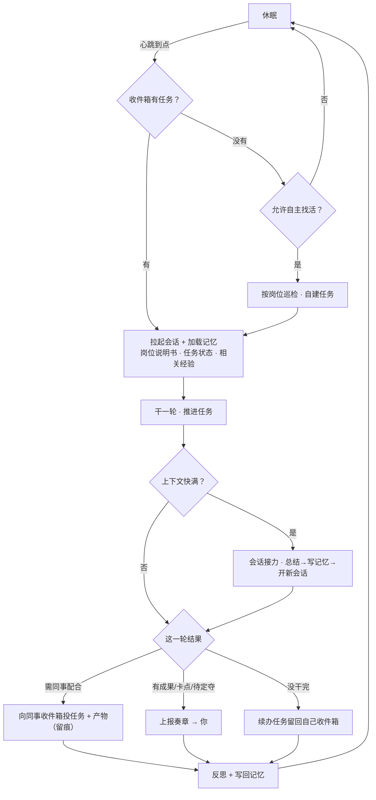
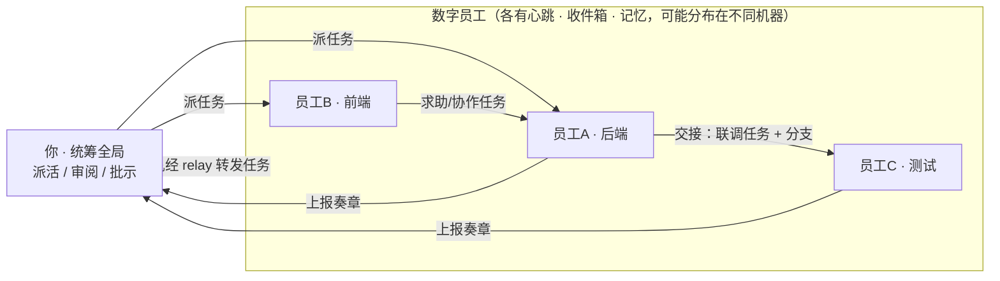

# 御书房 · 数字员工系统设计

> **一句话**：配置一批常驻的"数字员工"，各有岗位、各有心跳，靠**记忆 + 自我学习 + 会话接力**持续干活；他们像普通员工一样只管自己那摊事、不为全局负责，**由你为总体负责**——定期审阅他们上报的内容，他们继续工作。

| 项目 | 内容 |
| --- | --- |
| 文档定位 | 主设计方向（本项目新功能设想） |
| 依托产品 | Nova（Tauri 2 + SolidJS 桌面端，驱动 ACP 兼容 agent） |
| 与旧文档关系 | **本文取代"内阁会战"成为主线**；`御书房-AI内阁协作设计.md` 降级为"可选进阶：多员工协作编排" |
| 核心新增 | 心跳引擎 · 任务收件箱 · 记忆库 |

---

## 已定的关键决策

| 决策 | 结论 |
| --- | --- |
| **心跳** | 定时检查收件箱，有任务就干，没有就睡 |
| **协作** | 支持：员工点对点往对方收件箱投任务 + 产物 |
| **派活权限** | 职责内自主交接，全部留痕可回溯 |
| **主动性** | 每个员工可单独配置"是否允许自主找活" |
| **自我学习** | 先做经验沉淀 + 按需加载；岗位说明书由你改 |
| **全局责任** | 你负责总体拆分与方向；员工不为全局负责 |

---

## 一、核心理念

传统用法是"**被动工具**"：你戳一下，它动一下。这里要做的是"**常驻员工**"：

- **有岗位**：每个员工有一份岗位说明书（启动提示词），定义它是谁、负责什么、边界在哪。
- **有心跳**：不用你时时催，它按自己的节奏定时"上班"，查有没有活、有活就干。
- **有记性**：跨会话、跨天记得自己做过什么、学到什么、做到哪了。
- **会成长**：把经验教训沉淀下来，越干越顺。
- **能接力**：一个会话装不下就换一个接着干，可以无限期工作。
- **会汇报**：周期性把进展/成果/卡点上报，你审阅、批示，它继续。

关键分界：**它们不为全局负责**。怎么拆活、往哪走是你的事；员工只在自己岗位职责内把任务做好、需要时跟同事交接。没有中央大脑替你做全局编排。

---

## 二、七个零件

### 1. 岗位档案
一个员工 = 一个 agent 实例 + 一份**岗位说明书**（启动提示词）+ 配置（心跳周期、工作目录、模型、主动性开关、可交接的同事）。说明书**可手写，也可以生成**——你描述"我要个盯前端体验、每天巡检的员工"，由一个 meta-agent 产出说明书草稿，你改定。

### 2. 心跳引擎（核心 · 全新）
每个员工有独立心跳。到点唤醒 → **查收件箱** → 有任务就加载记忆干一轮 → 没有任务：若配置为"自主找活"则按岗位巡检自建任务，否则继续睡。心跳把"被动工具"变成"主动员工"。

### 3. 任务与收件箱
**任务**是流转的基本单元（谁派、干什么、附带什么产物、状态、留痕）。**每个员工一个收件箱**（待办队列），是心跳时检查的对象。任务来源三种：**你派的**、**同事交接的**、**自己上轮留下的续办**（或自主找活生成的）。

### 4. 记忆机制
让员工跨会话跨心跳"记得住"。分三层：
- **任务状态**：每个任务当前进度（做到哪、下一步）。
- **工作日志（情节记忆）**：发生过什么。
- **经验知识（语义记忆）**：教训、有效做法、你的偏好——**按相关性检索加载**，不全塞进上下文。

每次心跳开头加载相关记忆，结尾写回。

### 5. 自我学习（务实版）
不追求"改模型"。落地的是：每轮结束让员工**反思**"这次哪里可改进"，把经验/教训/你的反馈沉淀进语义记忆，下次自动加载 → 越干越顺。岗位说明书本身由你改（可控），暂不让员工自动改写。

### 6. 会话接力
单会话上下文会满。快满时：**总结当前会话 → 写入记忆 → 开新会话 → 从记忆恢复 → 接着干**。这是员工能"无限期工作"的关键。你现有的 `render_handoff_context` 基本现成。

### 7. 上报与审阅
员工周期性把**进展 / 成果 / 卡点 / 待你定夺**上报成"奏章"，进你的御案。你定期审阅、批示；反馈回注到员工记忆，影响下一轮。这是你"为总体负责"的抓手。

---

## 三、数据模型

```typescript
/** 数字员工 */
interface Employee {
  id: string;
  name: string;                       // "小前 · 前端专员"
  agentKind: string;                  // devin | codex | claude-code | gemini | ...
  model?: string;
  mode?: string;                      // code / ask / plan / bypass
  charter: string;                    // 岗位说明书（启动提示词），可手写或生成
  cwd: string;                        // 工作目录
  heartbeat: { everyMs: number; enabled: boolean };
  autonomy: "passive" | "self-directed";  // 没任务时是否自主找活
  peers: string[];                    // 职责内可自主交接的同事 id
}

/** 任务：员工间/人机间流转的基本单元 */
interface Task {
  id: string;
  title: string;
  brief: string;                      // 交办说明（含验收标准）
  from: string;                       // 派发者：user 或 员工id
  to: string;                         // 承办员工id
  artifacts?: Attachment[];           // 附带产物（分支/文件/说明）
  contractRef?: string;              // 可选：接口约定（协作涉及接口时）
  status: "queued" | "working" | "handed_off" | "reported" | "done" | "blocked";
  parentId?: string;                  // 派生自哪个任务（追溯 + 环检测）
  trace: TraceEntry[];                // 留痕：谁在何时对它做了什么
  createdAt: number;
  updatedAt: number;
}

/** 收件箱：每个员工一个 */
interface Inbox { employeeId: string; tasks: Task[] }

/** 记忆：每个员工一份，分层 */
interface Memory {
  employeeId: string;
  taskState: Record<string, unknown>; // 各任务进度
  journal: JournalEntry[];            // 工作日志（情节记忆）
  lessons: Lesson[];                  // 经验/教训/偏好（语义记忆，按需检索）
}

/** 奏章：上报给你的呈报 */
interface Report {
  id: string;
  from: string;                       // 员工id
  type: "progress" | "result" | "blocker" | "decision";
  title: string;
  body: string;
  taskId?: string;
  artifacts?: Attachment[];
  state: "pending" | "reviewed";
  rescript?: { decision: "approve" | "reject" | "revise"; comment?: string; ts: number };
  ts: number;
}
```

---

## 四、单个员工的心跳生命周期



---

## 五、员工协作与你的统筹



**协作边界（呼应"你为总体负责"）**

- **点对点交接**：员工在职责内可直接往同事（`peers` 范围内）收件箱投任务，无需每次问你。
- **全部留痕**：每次交接写入 `Task.trace`，你随时可回溯"谁把什么派给了谁、为什么"。
- **环检测**：靠 `parentId` 链 + 深度上限，防止 A↔B 互相派活死循环。
- **全局仍你定**：怎么拆活、优先级、方向，是你的事；员工不自动做全局编排。
- **接口对齐**：交接涉及接口时，附一份轻量约定（`contractRef`）即可；只有复杂场景才需要更正式的契约（见进阶文档）。

---

## 六、怎么落到 Nova 上

| 零件 | 复用现有 | 需新建 |
| --- | --- | --- |
| 岗位档案 | agent 后端 + 系统提示词 | 员工配置 + 说明书生成器 |
| 心跳引擎 | — | **调度器**（定时唤醒 + 查收件箱 + 巡检） |
| 任务/收件箱 | 持久化（ThreadStore 思路） | **任务模型 + 每员工收件箱** |
| 协作交接 | **relay 转发任务信封（跨机现成）** | 员工→员工投递 + 产物附带 + 留痕 |
| 记忆 | 附件内嵌（传产物） | **记忆库**（分层存储 + 检索/写回） |
| 会话接力 | **`render_handoff_context` 基本现成** | 阈值触发 + 恢复流程 |
| 上报审阅 | `advanced_share`（自动处理+上报雏形）、通知 | 奏章/审阅 UI + 上报节奏 |
| 执行/隔离 | Thread + worktree + 权限审批 | 员工与 Thread 的归属绑定 |

**真正全新的核心只有三样：心跳调度器 + 任务收件箱 + 记忆库。** 其余大多复用现有能力。

新增代码落点（示意）：`scheduler.rs`（心跳）、`inbox.rs`（任务/收件箱/留痕）、`memory.rs`（记忆库）、`employees.rs`（员工配置/说明书生成）；前端新增"员工管理""御案（上报流）""员工工作台"视图；`relay.rs` 加任务/上报消息类型；`server/main.go` 基本不动。

---

## 七、关键取舍与风险

| 风险 | 说明 | 缓解 |
| --- | --- | --- |
| **成本失控** | 心跳持续烧 token，尤其自主找活 | 心跳频率可调 + 全局暂停开关 + 额度护栏/提醒 + 自主找活默认关 |
| **跑偏** | 自主交接/找活可能偏离意图 | 全程留痕 + 定期审阅 + 职责边界 + 一键暂停某员工 |
| **心跳空转** | 没任务时反复唤醒浪费 | 空转只做轻量检查 + 退避（没活就拉长间隔） |
| **记忆膨胀** | 记忆越滚越大、加载变贵 | 分层 + 摘要压缩 + 归档/遗忘策略 + 按相关性检索 |
| **协作死循环** | A 派 B、B 又派 A | `parentId` 环检测 + 交接深度上限 + 留痕告警 |
| **接力信息损耗** | 多次接力后关键信息丢失 | 结构化记忆兜底（任务状态是硬事实，不只靠会话总结） |

---

## 八、分阶段路线图

```mermaid
flowchart LR
    subgraph P0["MVP：单员工闭环"]
        A0["配置员工 + 岗位说明书"]
        B0["心跳查收件箱 + 你派任务"]
        C0["干一轮 + 记忆 + 会话接力"]
        D0["上报奏章 + 你审阅批示"]
    end
    subgraph P1["V1：协作 + 好用"]
        A1["员工→员工收件箱投递 + 产物交接"]
        B1["留痕可回溯 + 环检测"]
        C1["反思沉淀经验 + 按需加载"]
        D1["御案上报流 UI + 通知"]
    end
    subgraph P2["V2：更强"]
        A2["自主找活（巡检型）"]
        B2["跨机协作（relay）"]
        C2["记忆归档 + 说明书生成器"]
        D2["可选进阶：多员工协作编排/契约"]
    end
    P0 --> P1 --> P2
```



**MVP 验收标准**：能配置一个员工（给岗位说明书 + 心跳 + 目录）；它到点自动查收件箱，把你派的任务干一轮，产出留痕、更新记忆、会话满能接力；干完/遇卡点上报奏章，你审阅批示后它下一轮继续。

---

> **小结**：这套系统 = 你已有的 **agent 后端 + worktree + 会话接力 + relay + 持久化** 之上，加**心跳调度器 + 任务收件箱 + 记忆库**三样新核心。它把"被动工具"变成"一批常驻、有记性、会成长、能协作的数字员工"——它们各司其职地持续工作，你只需在御书房里定期审阅、落笔批示。
