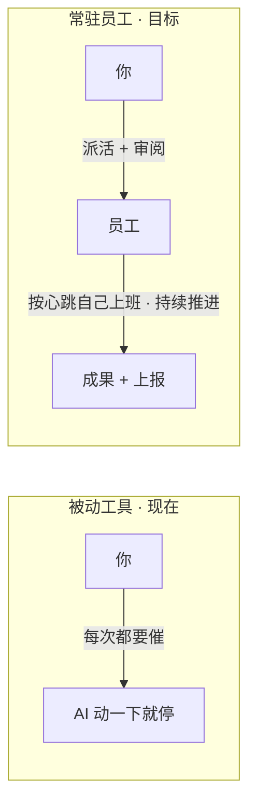
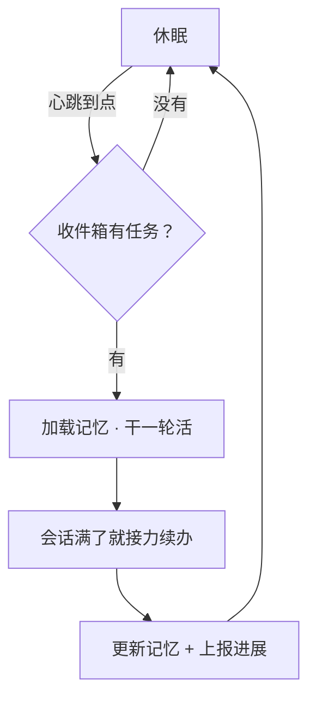
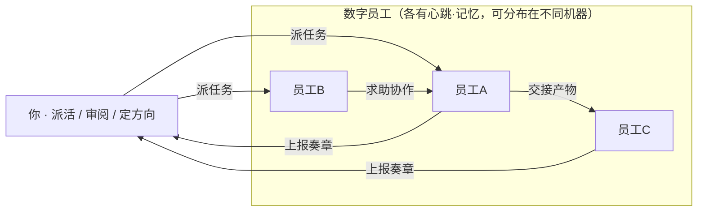

# 御书房 · 数字员工系统

### 配一批常驻的 AI 员工替你干活，你只管派活和审阅

> 给每个"数字员工"一份岗位说明书和一个心跳，他们就按自己的节奏上班干活——**有记性、会成长、能接力、能协作**。
> 你像老板一样：**派活、定期审阅上报、把握全局方向**；具体的活他们自己持续推进。

---

## 一、要解决什么问题

今天用 AI，大多是"**被动工具**"：你戳一下、它动一下，一停你就得再催。
我们想做"**常驻员工**"：你派完活就能走开，他们按心跳自己持续干，定期给你上报，你审阅后他们接着干。

| | 被动工具（现在） | 常驻数字员工（目标） |
| --- | --- | --- |
| 谁驱动 | 你，每一步都要催 | 员工自己的心跳 |
| 记性 | 关了就忘 | 有记忆，越干越顺 |
| 时长 | 一个会话就到头 | 会话接力，可无限期工作 |
| 你的角色 | 操作员 | 老板：派活 + 审阅 |

---

## 二、什么是"数字员工"

每个员工都有这几样：

- **岗位说明书**：定义它是谁、负责什么（可手写，也可以让 AI 帮你生成）。
- **心跳**：定时"上班"，查有没有活、有活就干。
- **记忆**：记得做过什么、学到什么、做到哪了。
- **成长**：把经验教训沉淀下来，下次做得更好。
- **接力**：一个会话装不下就换一个接着干。
- **协作**：需要时把活交接给同事，全程留痕。
- **汇报**：周期性上报进展/成果/卡点，等你批示。

---

## 三、他是怎么工作的

一个员工的"上班"循环，就是围着**心跳**转：

到点醒来 → 看有没有活 → 有就加载记忆干一轮 → 会话满了自动接力 → 更新记忆、该上报就上报 → 继续睡，等下一次心跳。

---

## 四、你只做两件事：派活 + 审阅

员工之间可以**互相交接**（在职责内自主、但全程留痕），而**全局怎么拆、往哪走由你定**——他们不为总体负责，你为总体负责。

---

## 五、关键设计

| 选择 | 怎么做 |
| --- | --- |
| **心跳驱动** | 定时查收件箱，有活就干，没活就睡 |
| **有记性、会成长** | 记忆库沉淀经验，按需加载，越干越顺 |
| **能接力** | 会话满了换一个接着干，无限期工作 |
| **能协作** | 员工间点对点交接，职责内自主 + 全程留痕 |
| **你管全局** | 拆活和方向你定，员工只管自己那一摊 |

---

## 六、不是从零造轮子

这套系统建立在产品**已经实现**的能力之上，只加"心跳 + 收件箱 + 记忆"三样新核心：

- **多会话并行**——多个员工同时干活
- **会话接力**——员工能无限期工作的关键（已有基础）
- **git worktree**——每个员工在独立分支目录干活，互不干扰
- **跨机漫游 + 中转服务**——员工可分布在不同机器，任务与上报跨机传递
- **持久化**——记忆、任务、上报都能留存

---

## 七、一句话收尾

> **让你从"每次都要催 AI 的操作员"，变成"一批常驻数字员工的老板"。**
> 你派活、定方向、审阅奏章；他们有记性、会成长、持续替你把活干下去。

---

*完整的架构、数据模型与实现方案，见 [`御书房-数字员工设计.md`](./御书房-数字员工设计.md)。*
