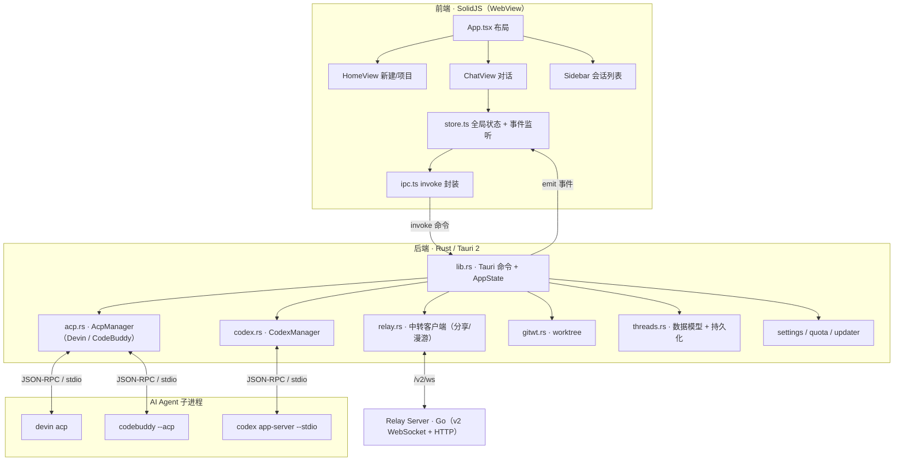
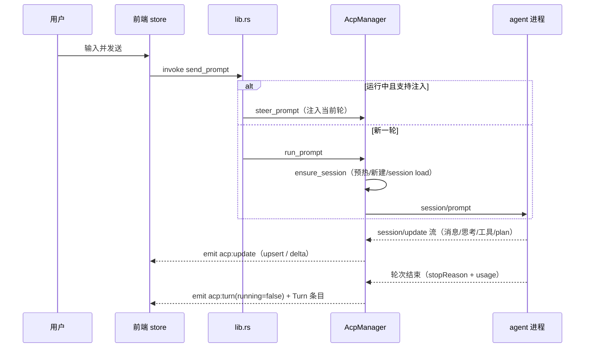
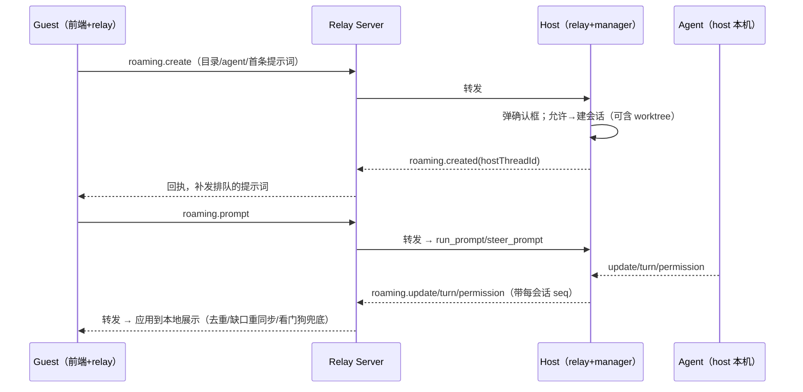

# Nova 项目架构总览

> 基于当前代码实测整理（非设想）。用于理解现状，为后续功能（如「数字员工」）打基础。

## 一、一句话定位

**Nova** 是一个 Codex 风格的桌面客户端，驱动 **ACP 兼容的 AI 编码 agent**（Devin / CodeBuddy / Codex），核心能力：

- **多会话并行**：多个 agent 会话同时跑，互不干扰。
- **团队分享**：把一段对话快照发给同事；「高级分享」还能先用模型处理再发。
- **跨机漫游**：在别人机器上新建会话并驱动，执行在对端、本机只接收展示。
- **worktree 隔离执行**：会话在独立 git 分支 + 工作目录中跑，不动主工作区。
- **静默自更新**：后端定时检测、下载暂存、空闲时自动重启升级。

## 二、技术栈

| 层 | 技术 |
| --- | --- |
| 前端 | SolidJS 1.9 + TypeScript 6 + Vite 8；`marked` + `dompurify`（Markdown 渲染）、`diff` |
| 桌面壳 / 后端 | Tauri 2 + Rust 2021；`tokio`、`reqwest`、`serde`、`uuid`、`chrono`、`zip`/`flate2`/`base64`；Windows：`tauri-winrt-notification`、`windows-sys` |
| 中转服务 | Go（v2 WebSocket + HTTP；保留 v1 兼容接口） |
| 通信 | 前端↔后端：Tauri `invoke`（命令）+ `emit/listen`（事件）；后端↔agent：JSON-RPC over stdio；跨机：v2 WebSocket |

产品名 `Nova`，标识 `com.nova.desktop`（旧 `com.fuckdevin.desktop` 首启自动迁移），版本 `0.1.113`。

## 三、三层架构



## 四、目录结构

```
fuckdevin/
├─ src/                      前端（SolidJS）
│  ├─ App.tsx                布局：Sidebar + (HomeView | ChatView) + 各 Modal
│  ├─ index.tsx             入口
│  ├─ store.ts              全局状态中枢 + 所有 Tauri 事件监听 + action
│  ├─ ipc.ts               invoke 封装（前后端 API 面，一一对应后端命令）
│  ├─ types.ts             所有 TS 数据模型
│  ├─ utils.ts
│  └─ components/           31 个组件（见第六节）
├─ src-tauri/               后端（Rust / Tauri）
│  ├─ src/
│  │  ├─ lib.rs            主入口：AppState、全部 #[tauri::command]、启动/迁移/更新循环
│  │  ├─ main.rs          调 nova_lib::run()
│  │  ├─ threads.rs       Thread/Item/AgentKind 模型、各 Store、上下文接力
│  │  ├─ acp.rs           AcpManager：ACP 协议（Devin + CodeBuddy 各一实例）
│  │  ├─ codex.rs         CodexManager：Codex app-server 原生协议
│  │  ├─ relay.rs         中转客户端：团队分享 + 漫游
│  │  ├─ gitwt.rs         git worktree 操作（命令行 git）
│  │  ├─ settings.rs      Settings 配置项 + 持久化
│  │  ├─ quota.rs         额度 / 模型费用查询
│  │  └─ updater.rs       自更新（下载/暂存/替换/重启/窗口恢复）
│  ├─ Cargo.toml
│  └─ tauri.conf.json
├─ server/                  中转服务（Go）
│  └─ main.go              Hub + Mailbox + WebSocket，哑管道转发
├─ docs/                    设计与说明文档
└─ package.json
```

## 五、后端模块职责

| 模块 | 职责要点 |
| --- | --- |
| **lib.rs** | 定义 `AppState`（见下）；注册全部 Tauri 命令（约 60 个）；启动流程（数据迁移→窗口恢复→强制升级→加载各 Store→连中转站→注册漫游转发器→更新定时器）；worktree 创建；退出清理临时会话 + 杀 agent 进程树 |
| **threads.rs** | 核心数据模型 `Thread`/`Item`/`AgentKind`/`Worktree`；持久化 Store（`ThreadStore`/`ProjectStore`/`RoamingStore`/`WorktreeStore`）；**上下文接力** `render_handoff_context`；附件内嵌/落盘 |
| **acp.rs** | `AcpManager`：管理 agent 子进程连接（JSON-RPC over stdio）、session 生命周期、prompt 驱动、流式 `session/update` 解析、权限、标题生成、预热、取消。**Devin 与 CodeBuddy 共用此实现、各起一个实例** |
| **codex.rs** | `CodexManager`：驱动 `codex app-server --stdio` 原生协议；支持 `run_prompt`/`steer_prompt`/`cancel`/`compact`（原生上下文压缩）/`prewarm`/权限（key 前缀 `codex-`） |
| **relay.rs** | `RelayManager`：v2 WebSocket 双向传输；团队分享、高级分享；漫游 guest/host 全套；出站顺序队列 + 合批 + 压缩；序号去重、缺口重同步、看门狗 |
| **gitwt.rs** | 命令行 git 封装：`is_repo`/`repo_root`/分支校验冲突/`list_branches`/worktree `add`/`remove`/删分支 |
| **settings.rs** | `Settings` 全部配置项（agent 路径/参数、默认模式、标题/分享模型、编辑器、主题、中转 server/token/groups/name、自更新、各后端开关、worktree 目录） |
| **quota.rs** | 查 Devin 剩余额度 + 模型费用（windsurf 后端） |
| **updater.rs** | 自更新：检查/下载暂存/替换 exe 重启/清理旧 exe/升级后窗口与会话恢复 |

**`AppState`（全局状态，`lib.rs`）**：`store`(会话) · `projects` · `settings` · `roaming` · `worktrees` · `acp`(Devin) · `codebuddy` · `codex` · `relay` · `config_dir` · `last_activity_ms` · `active_thread`。

## 六、前端结构

- **入口/布局**：`index.tsx` → `App.tsx`。布局 = `Sidebar` + （`currentId` 有值时 `ChatView`，否则 `HomeView`）+ 各 Modal（Settings/ShareInbox/RoamRequest/Update）。
- **状态中枢**：`store.ts` 单一 `createStore`，集中：会话列表/当前会话/transcript/运行态/权限/连接状态/模型选项/中转状态/在线名单/收件箱/漫游请求/主题等；`initStore()` 注册**所有 Tauri 事件监听**并做启动初始化（注意初始化顺序：settings→中转状态→会话列表→异步补 status/logs/模型）。
- **API 层**：`ipc.ts` 把每个后端命令封装成 `api.xxx`，是前后端契约的单一出入口。
- **组件（`components/`）分类**：
  - 对话：`ChatView`、`Composer`（输入）、`TurnGroup`、`TranscriptItem`、`ToolCallCard`、`PlanCard`、`EditedFilesCard`、`PermissionCard`、`Markdown`、`TypewriterText`、`ImageAttachmentStrip`
  - 导航/首页：`Sidebar`、`HomeView`、`ProjectPicker`、`FileContextMenu`
  - 配置/选择：`SettingsModal`、`ConfigSelects`、`SearchSelect`、`slashSuggestions`、`icons`
  - 团队/漫游：`ShareModal`、`ShareInboxModal`、`RoamRequestModal`
  - 其它：`UpdateModal`

## 七、核心数据模型与持久化

**`Thread`（一个会话）**：`id`/`title`/`cwd`/`agentKind`/`acpSessionId`/`model`/`mode`/`reasoningEffort`/`handoffFrom`(接力)/`ephemeral`(临时)/`roamingRole`(host|guest|无)/`roamingPeer`/`roamingRemoteId`/`worktree`/`items`/`plan`。

**`Item`（transcript 条目，带类型标签）**：`User` / `Assistant` / `Thought` / `Tool` / `System` / `Turn`（耗时 + token 用量）。

**`AgentKind`**：`Devin` | `Codex` | `CodeBuddy`。

**持久化文件**（应用数据目录，各 Store 用 JSON 落盘）：

| 文件 | 内容 |
| --- | --- |
| `threads.json` | 所有会话（含 transcript）；原子写（tmp→rename） |
| `projects.json` | 最近项目目录（最多 20） |
| `roaming.json` | 允许漫游的目录 |
| `worktrees.json` | 已创建 worktree 记录（会话删了也留，供手动清理） |
| `settings.json` | 全部设置（主题也在此，作为可靠真相） |
| `relay-inbox.json` | 收到的分享 |
| `relay-state.json` | 中转 `lastSeq`（断线重连补发基准） |

## 八、三种 Agent 后端对比

| 维度 | Devin | CodeBuddy | Codex |
| --- | --- | --- | --- |
| 管理器 | `AcpManager` | `AcpManager`（第二实例） | `CodexManager` |
| 协议 | 标准 ACP JSON-RPC/stdio | 同 ACP | Codex `app-server --stdio` 原生 |
| 并发 | **多路复用**（一连接多 session 并发） | **多进程并行**（每会话独占一条连接/进程，`serial_gate` 降为「同一线程连接内串行」；标题·探测走独立 AUX 连接） | 多 session |
| cwd 处理 | 走 `session/new` 的 cwd | **不认 session cwd**，按进程工作目录，每会话按自身目录起进程 | 走会话 cwd |
| 运行中追问 | `steer_prompt` 注入当前轮 | 同线程一律 `run_prompt` 排队（单连接不能并发两个 prompt）；不同线程各自连接、并行 | `steer_prompt` 注入 |
| 手动压缩上下文 | 不支持 | 不支持 | 支持（`thread/compact/start`） |
| 权限 key 前缀 | `perm-` | `cb-perm-` | `codex-` |

## 九、关键数据流

### 9.1 本地发一条消息



### 9.2 事件驱动的 UI（后端 `emit` → 前端 `store.ts` 监听）

| 事件 | 含义 |
| --- | --- |
| `acp:update` | transcript 增量：`upsert`/`delta`/`remove`/`plan`/`mode`（漫游可 `ops` 批量） |
| `acp:turn` | 轮次运行态变化 |
| `acp:permission` / `acp:permission-resolved` | 工具权限请求 / 已解决 |
| `acp:status` | agent 连接状态 |
| `acp:options` / `acp:commands` | 模型选项 / 斜杠命令 |
| `acp:log` | 日志行 |
| `threads:changed` / `threads:title-generated` | 会话列表变化 / AI 标题生成 |
| `acp:notify-open` / `acp:reload` | 通知点击跳转 / 漫游快照整段刷新 |
| `acp:worktree-ready` / `acp:worktree-failed` | worktree 后台创建结果 |
| `relay:status`/`peers`/`inbox`/`peer-models`/`peer-branches`/`roam-request` | 中转/漫游相关 |
| `update:progress` / `update:available` | 更新进度 / 就绪角标 |

### 9.3 跨机漫游



host 侧转发靠 `lib.rs::register_roaming_forwarders`：监听本机 `acp:update/turn/permission/...`，若线程 `is_hosted` 就转发给 guest。

### 9.4 其它流程

- **团队分享**：`share_thread` 把会话快照（内嵌附件）发到对端收件箱；`accept_share` 在本地新建会话导入。
- **高级分享**：`advanced_share` 本机起一个会话用指定模型处理原对话，跑完（监听 `acp:turn` 结束）自动把结果分享出去。
- **worktree**：`create_thread(worktree=true)` 先落库返回、后台 `git worktree add`，就绪发 `acp:worktree-ready`，前端补发暂存的首条提示词。
- **上下文接力**：跨 agent 切换（`set_thread_agent`）时记 `handoff_from`，下条消息前用 `render_handoff_context` 把历史渲染成文本注入新 agent。
- **自更新**：后端 tokio 定时器每 10 分钟检测+下载暂存；每 60 秒判定「已暂存+无会话运行+空闲超时」→ 静默替换重启；启动时若有更新的暂存包则强制升级。

## 十、中转服务（Go）协议

极简「哑管道」，不理解业务。桌面客户端只使用 v2；服务端继续保留 v1 供旧客户端使用：

| 端点 | 作用 |
| --- | --- |
| `GET /v2/ws` | WebSocket 双向收发；`messageId` 幂等 ACK，`since + serverEpoch` 断线恢复，15s Ping |
| `/v2/folders`、`/v2/peers` | 上报「可漫游目录」、主动拉在线名单 |
| `/v2/ledger/*`、`/v2/clues/*`、`/v2/remote/*` | 账本、证据链和桌面远控同步API |

- 每 token 一个 `Client`（=身份 + 收件箱），环形缓冲 4000 条供重连补发。
- `presence`（在线名单）按**群组隔离**：只推送与你共享至少一个群组的人。
- 消息类型（业务语义都在客户端 `relay.rs`）：`presence` / `share` / `roaming.create|prompt|cancel|permission_response|config|resync|models_request|branches_request`（guest→host）/ `roaming.created|models|branches|update|turn|permission|permission_resolved|snapshot|title|error`（host→guest）。

## 十一、并发与健壮性要点

- **进程树清理**：Windows 下 `taskkill /T /F` 递归杀 agent 及其 spawn 的 shell，避免孤儿堆积（退出/取消/重启/切目录都用）。
- **CodeBuddy 多进程并行**：CodeBuddy 的 ACP server 单条 stdio 连接不能并发（并发 prompt 会串台、单活跃 session），故改为**每个用户线程独占一条连接（一个进程，key=thread_id）**，真正并行；`serial_gate` 按 conn_key 分裂，只串行「同一线程连接内」的会话级操作；标题生成/模型·命令探测走独立 `AUX` 连接，互不占用。连接池 `slots` 按 key 管理，连接关闭回调按 key 只清理本连接会话（`alive_conns` 计数，归零才广播断连）。
- **漫游可靠传输**：v2 WebSocket ACK + `messageId` 防重；每会话单调 `seq` → guest 去重和缺口检测；轮次结束附全量快照收敛；guest 看门狗（4s 无事件重同步）；40s 空闲超时判死重连。v2 大帧使用 gzip 二进制，小帧保持 JSON 文本低延迟。
- **落盘策略**：`threads.json` 原子写；漫游流式期间节流落盘（1.5s），轮次结束强制落盘。
- **启动初始化顺序**：settings 最先（团队/主题依赖它）→ 中转状态 → 会话列表 → 异步补 status/logs/模型，避开 `getStatus` 抢连接锁的慢路径。

## 十二、与「数字员工」功能的衔接点

后续做常驻数字员工（心跳 + 收件箱 + 记忆），当前可复用/挂钩的位置：

| 新能力 | 复用/挂钩 |
| --- | --- |
| **心跳调度器** | 参照 `lib.rs` 里现有 tokio 定时器（更新检测/静默升级循环）与 `relay.rs` 的 worker 模式，新增独立调度模块 |
| **执行一轮** | 直接调 `AcpManager::run_prompt` / `CodexManager::run_prompt`（已具备会话、权限、流式、标题、持久化全套） |
| **会话接力** | `threads.rs::render_handoff_context` 基本现成，可用于上下文满时接力 |
| **任务收件箱** | 参照 `relay-inbox.json`（`Share` 收件箱）与各 `Store` 的 JSON 持久化模式，新增任务/收件箱 Store |
| **记忆库** | 参照各 `Store`（`ThreadStore` 等）落盘模式，新增分层记忆 Store |
| **跨机协作** | 复用 `relay.rs` 消息机制，新增 `task.*` 消息类型（服务端 `main.go` 无需改，哑管道透传） |
| **上报/审阅** | 复用 `share`/`advanced_share` + 事件通知（`notify_done` / winrt 通知） |
| **员工配置** | 参照 `Settings` + `settings.json`，或独立 `employees.json` Store |
| **前端视图** | 新增「员工管理 / 御案（上报流）/ 工作台」视图，接入 `store.ts` 事件模式 |

**真正需要新增的核心只有三样：心跳调度器 + 任务收件箱 Store + 记忆库 Store**；执行、接力、跨机、上报、持久化模式均可复用。
